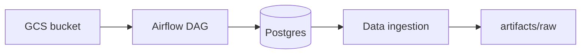
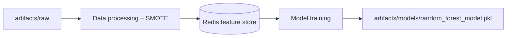
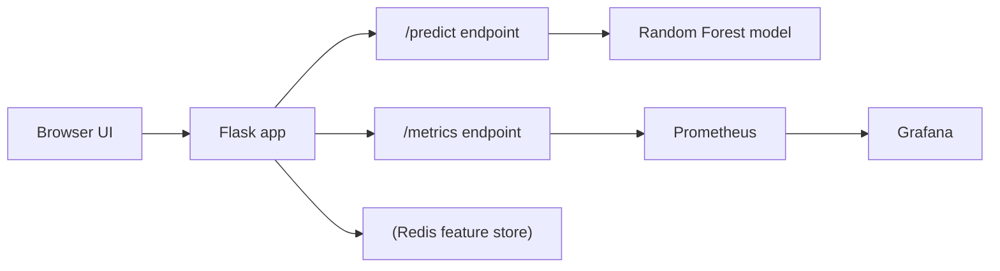

# MLOps | Titanic Survival Prediction

An end-to-end MLOps project that takes raw Titanic data from Postgres, engineers features, trains a Random Forest model, serves predictions through a Flask web app, and monitors drift and usage with Prometheus and Grafana.

## Pipeline Overview

### Data Engineering


### ML Pipeline


### Serving and Monitoring


## Why this project
- Short feedback loop from data ingestion to live inference.
- Feature store + drift detection for production-friendly model behavior.
- Monitoring baked in (prediction count + drift count) from day one.

## Demo


## Quick Start
1) Prerequisites:
   - Python 3.12
   - Docker (for Prometheus and Grafana)
   - Redis (local or container)
   - Postgres (local or container)
   - Optional: Astro CLI (for Airflow DAGs)

2) Install dependencies:
```powershell
python -m venv .venv
.venv\Scripts\activate
pip install -r requirements.txt
```

3) Start Redis and Postgres (example with Docker):
```powershell
docker run --name mlops-postgres -e POSTGRES_PASSWORD=postgres -p 5432:5432 -d postgres:16
docker run --name mlops-redis -p 6379:6379 -d redis:7
```

4) Run the training pipeline:
```powershell
python pipeline\training_pipeline.py
```
This performs ingestion from Postgres, feature engineering + SMOTE, writes features to Redis, and trains the model into `artifacts/models/`.

5) Run the Flask app:
```powershell
python app.py
```
Open `http://localhost:5000` to use the UI. Metrics are exposed at `http://localhost:5000/metrics`.

6) Start monitoring:
```powershell
docker compose up -d
```
Prometheus runs on `http://localhost:9090` and Grafana on `http://localhost:3000` (admin/admin).


## Tech Stack
- Front end: HTML + Jinja templates in `templates/index.html`, CSS in `static/style.css`.
- Back end: Flask (`app.py`) with pandas, scikit-learn, and alibi-detect for drift checks.
- Data pipeline: pandas + SQLAlchemy for ingestion, SMOTE for class balancing.
- Feature store: Redis (`src/feature_store.py`).
- Monitoring: Prometheus + Grafana (`prometheus.yml`, `docker-compose.yml`).
- Orchestration: Airflow DAGs in `dags/` (optional ingestion path from GCS to Postgres).

### AWS mapping (deployment option)
This repo runs locally, but maps cleanly to AWS services:
- Compute: EC2 or ECS for the Flask app and monitoring stack.
- Storage: S3 for model artifacts and datasets.
- Database: RDS for Postgres.
- Feature store: ElastiCache for Redis.
- Observability: CloudWatch logs or keep Prometheus + Grafana on EC2.

## Monitoring UI (screenshots)


## Airflow Ingestion (Optional)
There is a DAG in `dags/extract_data_from_gcp.py` that pulls the dataset from GCS into Postgres. It is designed for Astronomer local dev:
```powershell
astro dev start
```
Trigger `extract_titanic_data` from the Airflow UI. This DAG is optional; the pipeline can also ingest directly from Postgres using `src/data_ingestion.py`.

## Project Structure
- `app.py`: Flask inference service with drift detection and Prometheus metrics.
- `pipeline/training_pipeline.py`: Full training orchestrator.
- `src/`: ingestion, processing, feature store, training, logging utilities.
- `templates/`: Jinja HTML UI.
- `static/`: CSS and UI assets.
- `artifacts/`: raw data and trained model outputs.
- `dags/`: Airflow ingestion workflows.
- `prometheus.yml` and `docker-compose.yml`: monitoring stack.

## Guides and References
- `src/README.md`: Core pipeline modules.
- `notebook/README.md`: EDA notebook guidance.
- `dags/README.md`: Airflow DAG setup.
- `static/README.md`: UI styling notes.
- `config/README.md`: configuration overview.
