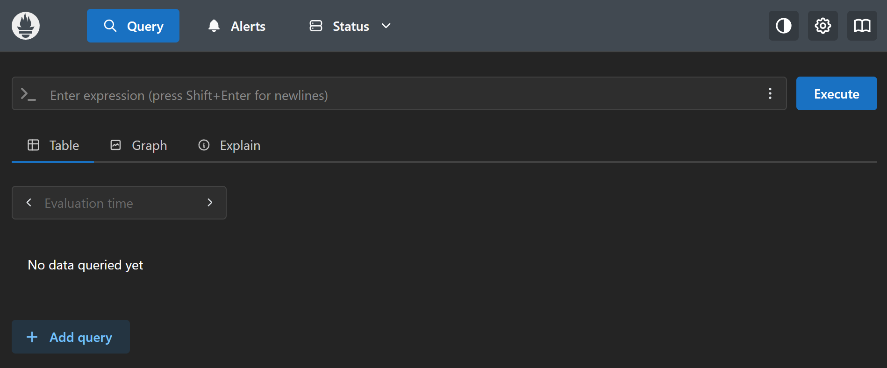
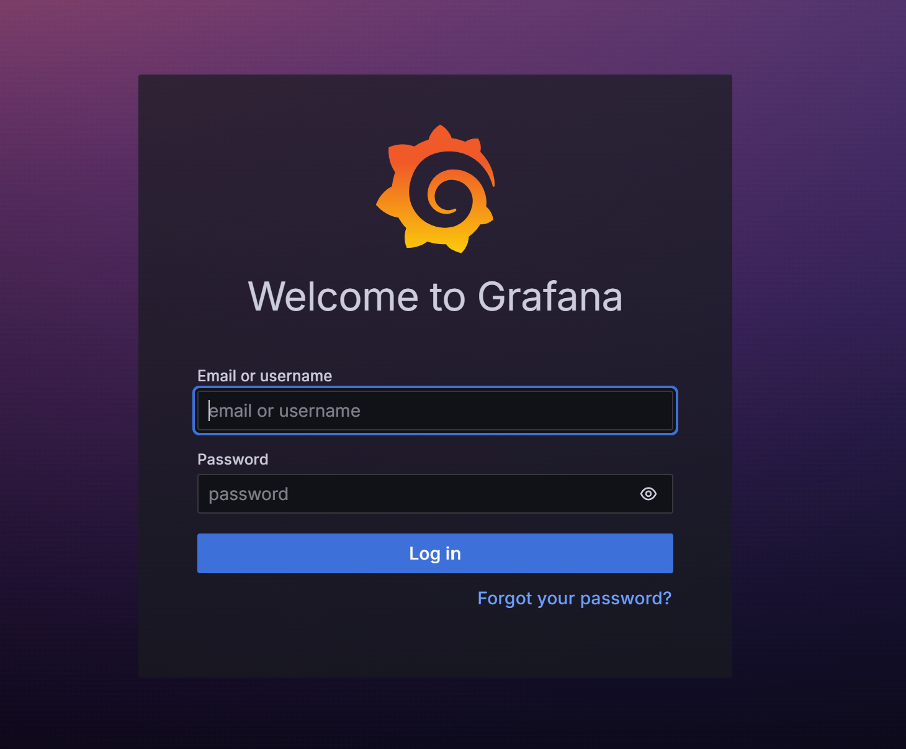
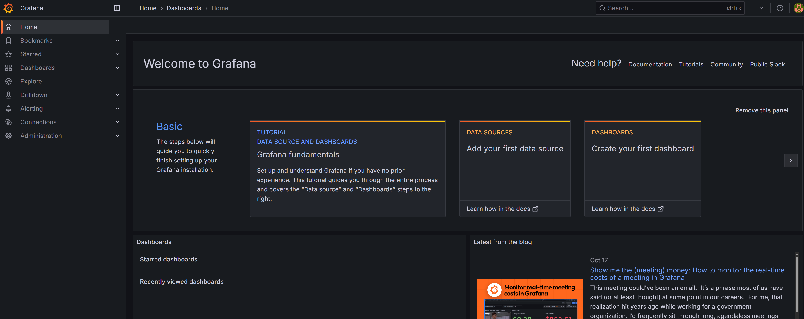
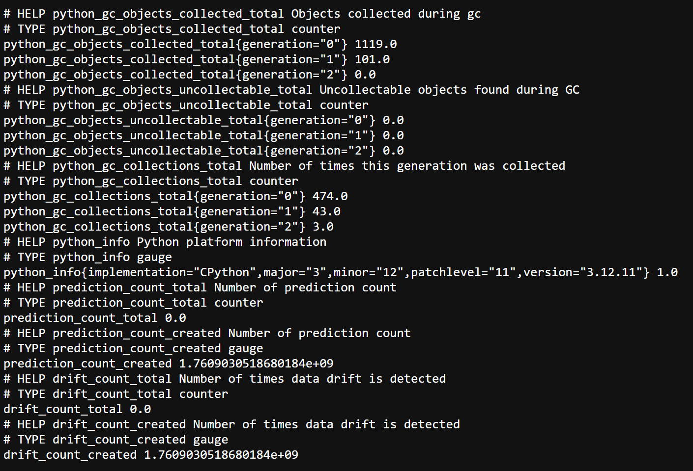
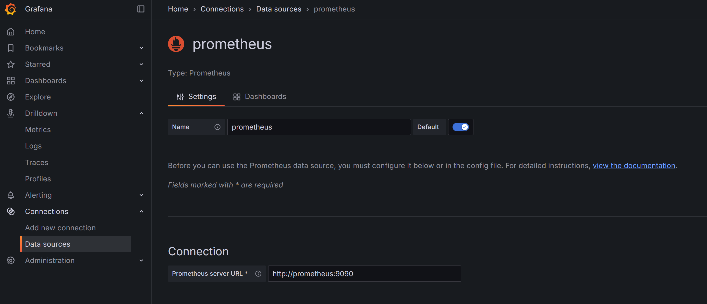
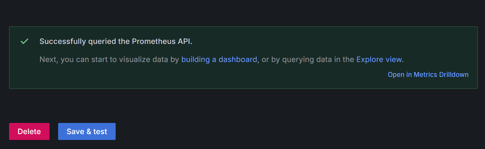
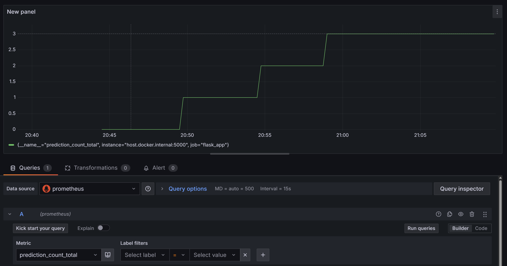
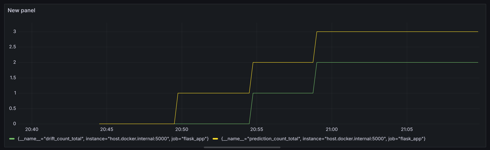

# 📊 **Monitoring with Prometheus & Grafana**


This final stage integrates **Prometheus** and **Grafana** to enable real-time **monitoring**, **visualisation**, and **alerting** for your Flask inference app.  
You will now be able to track live metrics on:
- 🧠 **Prediction Count** — total number of predictions served  
- ⚠️ **Drift Count** — total number of times data drift was detected  

Together, these complete your end-to-end MLOps pipeline:  
**Data ➜ Model ➜ Inference ➜ Monitoring**


## 🧩 **Overview**

In this stage you’ll:
1. Create the Prometheus and Docker Compose configuration files.  
2. Run both **Prometheus** and **Grafana** in the same Docker Compose network.  
3. Collect metrics automatically from the Flask app at `http://localhost:5000/metrics`.  
4. Visualise those metrics on a custom Grafana dashboard.


## ⚙️ **Step 1 — Create Required YAML Files**

Two configuration files are needed in the **project root**:

### 🧾 `prometheus.yml`
Defines Prometheus scrape settings (including your Flask app metrics endpoint).

### 🧾 `docker-compose.yml`
Bridges Prometheus and Grafana containers so they share the same network.

These two files allow Prometheus to collect the `/metrics` data exposed by your Flask app and Grafana to visualise it seamlessly.


## 🧱 **Step 2 — Run the Monitoring Stack**

In your terminal (from the project root):

```bash
docker compose up -d
````

This will pull and launch the Prometheus and Grafana Docker images.
Once running, check **Docker Desktop** → **Containers** tab — you should see both running in the same stack:


## 🖥️ **Step 3 — Access Prometheus**

Visit:

🔗 **[http://localhost:9090/](http://localhost:9090/)**

You’ll see the Prometheus dashboard interface:



Prometheus will automatically scrape the `/metrics` endpoint of your Flask app every **15 seconds**.


## 📊 **Step 4 — Access Grafana**

Next, open:

🔗 **[http://localhost:3000/](http://localhost:3000/)**

You’ll be greeted by the Grafana login screen:



Use:

```
Username: admin
Password: admin
```

After login, you’ll enter the Grafana main dashboard:




## ⚙️ **Step 5 — Ensure Flask App is Running**

Before metrics can be collected, your inference app must be live.

```bash
python app.py
```

This starts:

* Flask web server → `http://localhost:5000/`
* Prometheus metrics endpoint → `http://localhost:5000/metrics`

Visit the metrics endpoint:



You’ll see your counters defined in the Flask script:

```
# HELP prediction_count Number of prediction count
# TYPE prediction_count counter
prediction_count_total 0.0

# HELP drift_count Number of times data drift is detected
# TYPE drift_count counter
drift_count_total 0.0
```

These are scraped automatically by Prometheus at 15-second intervals.


## 🔢 **Step 6 — Generate Metrics via the Flask App**

Open the app at `http://localhost:5000/` and submit some predictions.

1️⃣ **First prediction**

* Go back to `http://localhost:5000/metrics` → refresh after 15–20 s
* You’ll now see:

  ```
  prediction_count_total 1.0
  drift_count_total 0.0
  ```

2️⃣ **Trigger a drift**

* Use extreme inputs (e.g., Age = 150, Fare = 0)
* Wait 15–20 s and refresh again:

  ```
  prediction_count_total 2.0
  drift_count_total 1.0
  ```

Prometheus has now collected the updated metrics, and you can visualise them directly in Grafana.


## 📡 **Step 7 — Link Prometheus to Grafana**

In Grafana’s left-hand toolbar:

1. Navigate to **Connections → Data Sources**
2. Click **Add data source**
3. Select **Prometheus**
4. In the *Prometheus server URL* field, enter:

   ```
   http://prometheus:9090
   ```

   *(Use `prometheus`, not `localhost`, since both services run inside Docker Compose.)*



Scroll down and click **Save & Test**:



You should see a confirmation message that Grafana successfully connected to Prometheus.


## 📈 **Step 8 — Create a Grafana Dashboard**

Now, let’s visualise the metrics you just generated.

1. In Grafana, go to **Dashboards → + New → New Dashboard → Add Visualization**
2. Choose **Prometheus** as the data source
3. From the metric dropdown, select **`prediction_count_total`**
4. Click **Run queries** — you’ll see the live counter value



5. Now click **+ Add query**
6. Select **`drift_count_total`**
7. Click **Run queries** again — both metrics appear in the same graph



Grafana now visualises:

* 3 ✅ Predictions served
* 2 ⚠️ Drift detections observed

Your **monitoring pipeline** is officially live!


## 🧱 **Final Project Structure**

```text
mlops-titanic-survival-prediction/
├── artifacts/
│   ├── raw/
│   ├── processed/
│   └── models/
│       └── random_forest_model.pkl
├── config/
│   ├── database_config.py
│   └── paths_config.py
├── img/
│   └── monitoring/
│       ├── compose_stack.png
│       ├── prom_ui.png
│       ├── grafana_login.png
│       ├── grafana_ui.png
│       ├── localhost_metrics.png
│       ├── prom_grafana_link.png
│       ├── test_link.png
│       ├── query_1.png
│       └── query_2.png
├── logs/
│   └── log_YYYY-MM-DD.log
├── notebook/
│   └── titanic.ipynb
├── pipeline/
│   └── training_pipeline.py
├── src/
│   ├── custom_exception.py
│   ├── logger.py
│   ├── data_ingestion.py
│   ├── feature_store.py
│   ├── feature_processing.py
│   └── model_training.py
├── templates/
│   └── index.html
├── static/
│   └── style.css
├── prometheus.yml                # Prometheus scrape config
├── docker-compose.yml            # Compose stack bridging Prometheus + Grafana
├── app.py                        # Flask inference + Prometheus exporter
├── requirements.txt
├── setup.py
└── README.md
```


## 🧠 **What You Achieved**

✅ Real-time metric collection via **Prometheus**
✅ Interactive visualisation in **Grafana**
✅ Seamless bridge between **Flask inference** and **monitoring stack**
✅ Reproducible setup using **Docker Compose**
✅ Full end-to-end MLOps workflow — from ingestion to deployment to observability


## 🎯 **Next Steps**

* 📦 Integrate **Grafana alerts** for abnormal drift spikes
* ☁️ Deploy the entire stack on **AWS EC2** or **GCP VM**
* 🔁 Automate metric refreshes and dashboard provisioning via **Grafana JSON** exports

Congratulations — you’ve built a **complete MLOps system** with continuous **training ➜ inference ➜ monitoring**.
